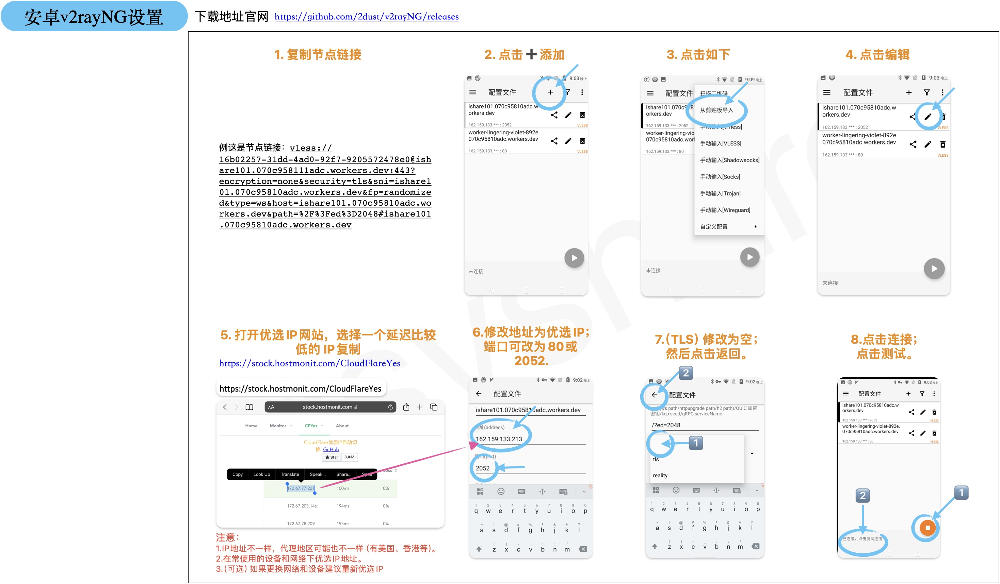
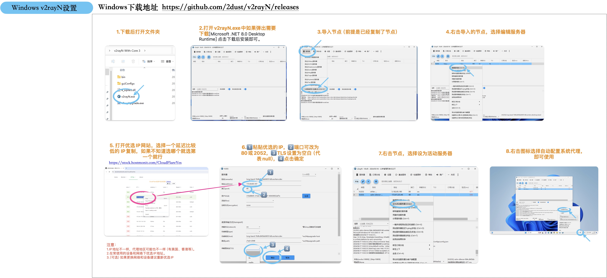
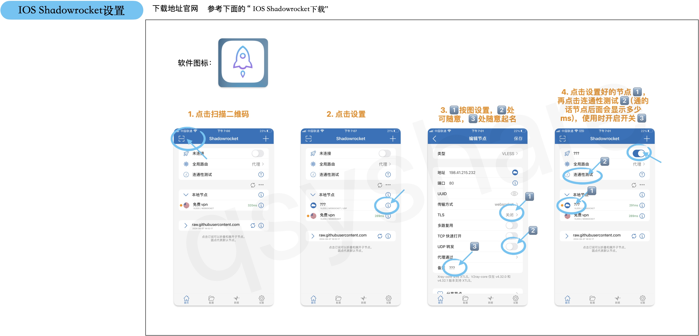
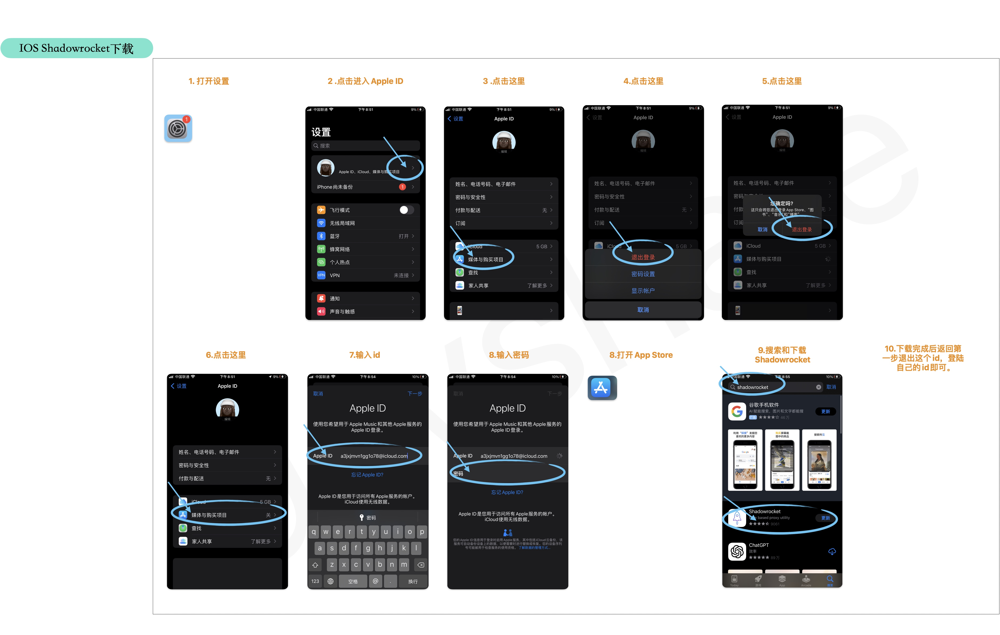
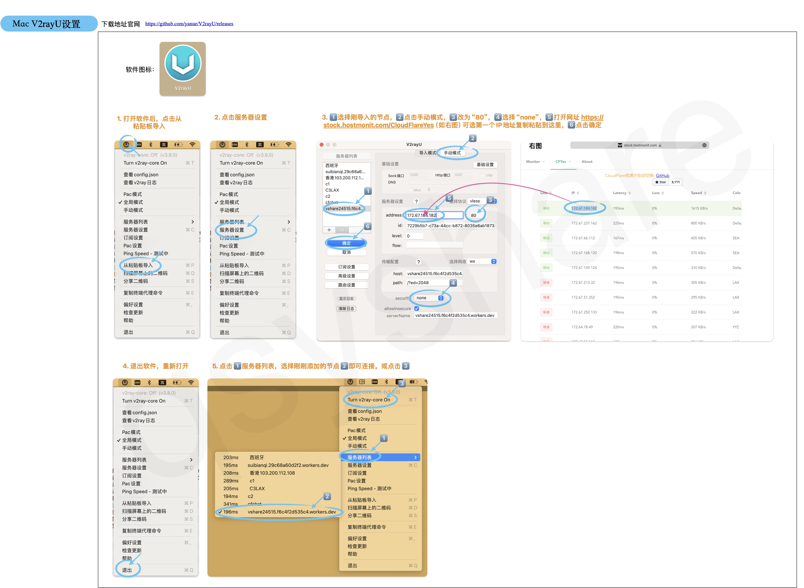

# 节点的使用
下面这是我瞎编的不能用的节点，演示：
```
vless://16b02257-31dd-4ad0-92f7-9205572478e0@ishare101.070c958111adc.workers.dev:443?encryption=none&security=tls&sni=ishare101.070c95810adc.workers.dev&fp=randomized&type=ws&host=ishare101.070c95810adc.workers.dev&path=%2F%3Fed%3D2048#ishare101.070c95810adc.workers.dev

```
# 安卓 [v2rayNG](https://github.com/2dust/v2rayNG/releases) 设置

> 一个节点可以添加多次，可以按5、6步更改不同的IP使用。

-------

# Windows [v2rayN](https://github.com/2dust/v2rayN/releases) 设置


-------
# IOS Shadowrocket设置

> 如果没有二维码，就从第2步点击右上角的加号，按第3步的图片进行设置。

> 或者用其它的设备软件导入后，再分享二维码。

#### **IOS Shadowrocket下载** <!-- {docsify-ignore} -->
这是付费软件，不过有共享账号可供下载。


-------
# Mac [V2rayU](https://github.com/yanue/V2rayU/releases) 设置

